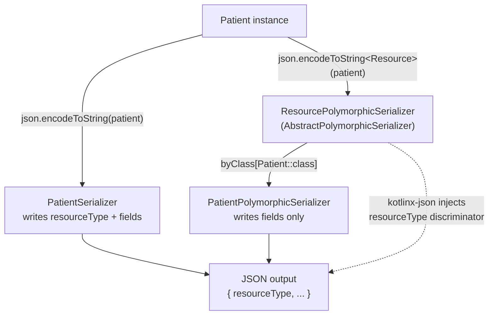
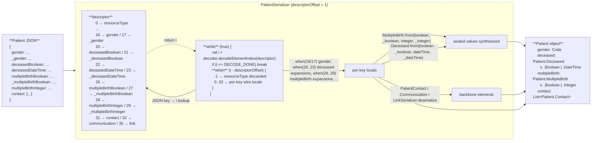
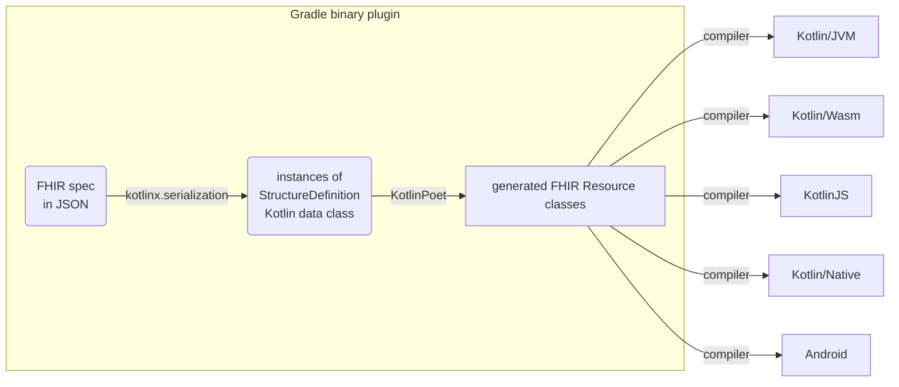

# Kotlin FHIR

[](https://central.sonatype.com/artifact/dev.ohs.fhir/fhir-model)
[](https://central.sonatype.com/artifact/dev.ohs.fhir/fhir-model-r4)
[](https://central.sonatype.com/artifact/dev.ohs.fhir/fhir-model-r4b)
[](https://central.sonatype.com/artifact/dev.ohs.fhir/fhir-model-r5)
[](https://opensource.org/licenses/Apache-2.0)

Kotlin FHIR is a lean and fast implementation of the
[HL7® FHIR®](https://www.hl7.org/fhir/overview.html) data model on
[Kotlin Multiplatform](https://kotlinlang.org/docs/multiplatform.html).

## Key features

* Lightweight & fast with a minimal footprint and zero bloat[^1]
* Clean, modern & elegant Kotlin code with minimalistic class definitions
* Code generation[^2] from FHIR specifications for completeness and maintainability
* JSON only[^3], no [XML](https://build.fhir.org/xml.html)
  or [Turtle](https://build.fhir.org/rdf.html) dependencies
* Multiplatform support for Android, iOS and web development, with JVM, native
  code and JavaScript targets
* Support for multiple FHIR versions

[^1]: No dependencies on logging, XML, or networking libraries or any platform-specific
dependencies. Only essential Kotlin Multiplatform dependencies are included, e.g.,
[`kotlinx.serialization`](https://github.com/Kotlin/kotlinx.serialization),
[`kotlix.datetime`](https://github.com/Kotlin/kotlinx-datetime), and
[Kotlin Multiplatform BigNum](https://github.com/ionspin/kotlin-multiplatform-bignum).

[^2]: Using [KotlinPoet](https://square.github.io/kotlinpoet/).

[^3]: It is also possible to serialize to other formats
[`kotlinx.serialization`](https://github.com/Kotlin/kotlinx.serialization) supports, such as
[protocol buffers](https://protobuf.dev/). However, there is no XML or Turtle support as of
Jan 2025.

## Supported platforms

The library supports the following
[target platforms](https://kotlinlang.org/docs/multiplatform-dsl-reference.html#targets):

| Target platform                    | Gradle target | Artifact suffix | Support |
|:-----------------------------------|:--------------|:----------------|:--------|
| Kotlin/JVM                         | `jvm`         | `-jvm`          | ✅       |
| Kotlin/Wasm                        | `wasmJs`      | `-wasm-js`      | ✅       |
| Kotlin/Wasm                        | `wasmWasi`    | `-wasm-wasi`    | ✅       |
| Kotlin/JS                          | `js`          | `-js`           | ✅       |
| Android applications and libraries | `android`     | `-android`      | ✅       |

The library also supports the following
[Kotlin/Native targets](https://kotlinlang.org/docs/native-target-support.html):

| Gradle target     | Artifact suffix      | Tier | Support |
|:------------------|:---------------------|:-----|:--------|
| iosSimulatorArm64 | `-iossimulatorarm64` | 1    | ✅       |
| iosArm64          | `-iosarm64`          | 1    | ✅       |
| iosX64            | `-iosx64`            | 3    | ✅       |

<details>
<summary><b>View Target Platform Artifact Matrix</b></summary>
<br/>

Each library artifact is published with platform-specific variants. The table below shows the Maven Central release status for every artifact–platform combination:

| Platform          | `fhir-model`<br/>(R4 + R4B + R5)                                                                                                                                                                                                                                             | `fhir-model-r4`                                                                                                                                                                                                                                                                           | `fhir-model-r4b`                                                                                                                                                                                                                                                                               | `fhir-model-r5`                                                                                                                                                                                                                                                                            |
|:------------------|:-----------------------------------------------------------------------------------------------------------------------------------------------------------------------------------------------------------------------------------------------------------------------------|:------------------------------------------------------------------------------------------------------------------------------------------------------------------------------------------------------------------------------------------------------------------------------------------|:-----------------------------------------------------------------------------------------------------------------------------------------------------------------------------------------------------------------------------------------------------------------------------------------------|:-------------------------------------------------------------------------------------------------------------------------------------------------------------------------------------------------------------------------------------------------------------------------------------------|
| **Root (KMP)**    | [](https://central.sonatype.com/artifact/dev.ohs.fhir/fhir-model)                                                                         | [](https://central.sonatype.com/artifact/dev.ohs.fhir/fhir-model-r4)                                                                         | [](https://central.sonatype.com/artifact/dev.ohs.fhir/fhir-model-r4b)                                                                         | [](https://central.sonatype.com/artifact/dev.ohs.fhir/fhir-model-r5)                                                                         |
| **JVM**           | [](https://central.sonatype.com/artifact/dev.ohs.fhir/fhir-model-jvm)                                                         | [](https://central.sonatype.com/artifact/dev.ohs.fhir/fhir-model-r4-jvm)                                                         | [](https://central.sonatype.com/artifact/dev.ohs.fhir/fhir-model-r4b-jvm)                                                         | [](https://central.sonatype.com/artifact/dev.ohs.fhir/fhir-model-r5-jvm)                                                         |
| **Wasm-JS**       | [](https://central.sonatype.com/artifact/dev.ohs.fhir/fhir-model-wasm-js)                                         | [](https://central.sonatype.com/artifact/dev.ohs.fhir/fhir-model-r4-wasm-js)                                         | [](https://central.sonatype.com/artifact/dev.ohs.fhir/fhir-model-r4b-wasm-js)                                         | [](https://central.sonatype.com/artifact/dev.ohs.fhir/fhir-model-r5-wasm-js)                                         |
| **Wasm-Wasi**     | [](https://central.sonatype.com/artifact/dev.ohs.fhir/fhir-model-wasm-wasi)                                 | [](https://central.sonatype.com/artifact/dev.ohs.fhir/fhir-model-r4-wasm-wasi)                                 | [](https://central.sonatype.com/artifact/dev.ohs.fhir/fhir-model-r4b-wasm-wasi)                                 | [](https://central.sonatype.com/artifact/dev.ohs.fhir/fhir-model-r5-wasm-wasi)                                 |
| **JS**            | [](https://central.sonatype.com/artifact/dev.ohs.fhir/fhir-model-js)                                                             | [](https://central.sonatype.com/artifact/dev.ohs.fhir/fhir-model-r4-js)                                                             | [](https://central.sonatype.com/artifact/dev.ohs.fhir/fhir-model-r4b-js)                                                             | [](https://central.sonatype.com/artifact/dev.ohs.fhir/fhir-model-r5-js)                                                             |
| **Android**       | [](https://central.sonatype.com/artifact/dev.ohs.fhir/fhir-model-android)                                         | [](https://central.sonatype.com/artifact/dev.ohs.fhir/fhir-model-r4-android)                                         | [](https://central.sonatype.com/artifact/dev.ohs.fhir/fhir-model-r4b-android)                                         | [](https://central.sonatype.com/artifact/dev.ohs.fhir/fhir-model-r5-android)                                         |
| **iOS Simulator** | [](https://central.sonatype.com/artifact/dev.ohs.fhir/fhir-model-iossimulatorarm64) | [](https://central.sonatype.com/artifact/dev.ohs.fhir/fhir-model-r4-iossimulatorarm64) | [](https://central.sonatype.com/artifact/dev.ohs.fhir/fhir-model-r4b-iossimulatorarm64) | [](https://central.sonatype.com/artifact/dev.ohs.fhir/fhir-model-r5-iossimulatorarm64) |
| **iOS Device**    | [](https://central.sonatype.com/artifact/dev.ohs.fhir/fhir-model-iosarm64)                                     | [](https://central.sonatype.com/artifact/dev.ohs.fhir/fhir-model-r4-iosarm64)                                     | [](https://central.sonatype.com/artifact/dev.ohs.fhir/fhir-model-r4b-iosarm64)                                     | [](https://central.sonatype.com/artifact/dev.ohs.fhir/fhir-model-r5-iosarm64)                                     |
| **iOS x64**       | [](https://central.sonatype.com/artifact/dev.ohs.fhir/fhir-model-iosx64)                                             | [](https://central.sonatype.com/artifact/dev.ohs.fhir/fhir-model-r4-iosx64)                                             | [](https://central.sonatype.com/artifact/dev.ohs.fhir/fhir-model-r4b-iosx64)                                             | [](https://central.sonatype.com/artifact/dev.ohs.fhir/fhir-model-r5-iosx64)                                             |

</details>

## Data model

### Mapping FHIR primitive data types to Kotlin

In FHIR, primitive data types (e.g. in [R4](https://hl7.org/fhir/R4/datatypes.html)) are defined
using StructureDefinitions[^4]. For instance, the `date` type is defined in
`StructureDefinition-date.json`. While primitive, these types may include an `id` and `extension`s,
preventing direct mapping to Kotlin's primitive types. To resolve this issue, the library generates
a distinct Kotlin class for each FHIR primitive data type, for example, the `Date` class in`Date.kt`
file for the `date` type.

[^4]: A "JSON Definition" link to the StructureDefinition is now included for each FHIR primitive
data type in the [Data Types](https://build.fhir.org/datatypes.html) page in FHIR CI-BUILD.

However, the actual values within these FHIR primitive data types defined using FHIRPath types (e.g.
the `integer.value` element in `StructureDefinition-integer.json` has the FHIRPath type
`System.Integer`) still need to be mapped to Kotlin types in the generated code. The mapping is as
follows:

| FHIRPath type  | Kotlin type  |
|-----------------------------------------------------------------------------|-----------------------------------------------------------------------------|
| System.Boolean                                                              | kotlin.Boolean                                                              |
| System.String                                                               | kotlin.String                                                               |
| System.Integer                                                              | kotlin.Int                                                                  |
| System.Long                                                                 | kotlin.Long                                                                 |
| System.Decimal                                                              | com.ionspin.kotlin.bignum.decimal.BigDecimal                                |
| System.Date                                                                 | FhirDate                                                                    |
| System.Time                                                                 | kotlinx.datetime.LocalTime                                                  |
| System.DateTime                                                             | FhirDateTime                                                                |

> **Note:** [Kotlin Multiplatform BigNum](https://github.com/ionspin/kotlin-multiplatform-bignum)
> library's `BigDecimal` is used to preserve and respect the precision of decimal values as required
> by the specification. See the notes section in [Datatypes](https://hl7.org/fhir/datatypes.html).
>
> **Note:**  The `System.Date` and `System.DateTime` types are mapped to sealed interfaces
> `FhirDate` and `FhirDateTime` specifically generated to handle partial dates in FHIR. They are
> implemented using `LocalDate`, `LocalDateTime` and `UtcOffset` classes in the `kotlinx-datetime`
> library.

Since all FHIR data types are defined using FHIRPath types in their StructureDefinitions, mapping
FHIRPath types to Kotlin effectively covers all FHIR data types. For brevity, the full FHIR data
type mapping to Kotlin is omitted here. However, notable exceptions exist where the FHIR data type
uses a FHIRPath type that is either inconsistent with the base data type, or is unsuitable for
represent the data in Kotlin. These exceptions are listed below:

| FHIR data type  | FHIRPath type  | Kotlin type  |
|------------------------------------------------------------------------------|-----------------------------------------------------------------------------|-----------------------------------------------------------------------------|
| positiveInt                                                                  | System.String                                                               | Kotlin.Int                                                                  |
| unsignedInt                                                                  | System.String                                                               | Kotlin.Int                                                                  |

### Mapping FHIR data structure to Kotlin

Similarly, for more complex data structures in FHIR such as complex data types and FHIR resources,
the library maps each StructureDefinition JSON file to a dedicated Kotlin `.kt` file, each
containing a Kotlin data class representing the StructureDefinition. BackboneElements in FHIR are
represented as nested data classes since they are never reused outside the StructureDefinition. For
each occurrence of a choice type (e.g. in [R4](https://hl7.org/fhir/R4/formats.html#choice)), a
single sealed interface is generated with a subclass for each type.

| FHIR concept  |                  Kotlin concept                    |
|----------------------------------------------------------------------------|-------------------------------------------------------------------------------------------------------------------|
| StructureDefinition JSON file (e.g. `StructureDefinition-Patient.json`)    | Kotlin .kt file (e.g. `Patient.kt`)                                                                               |
| StructureDefinition (e.g. `Patient`)                                       | Kotlin data class (e.g. `data class Patient`)                                                                     |
| BackboneElement (e.g. `Patient.contact`)                                   | Nested Kotlin data class (e.g. `data class Contact` nested under `Patient`)                                       |
| Choice of data types (e.g. `Patient.deceased[x]`)                          | Sealed interface (e.g. `sealed interface Deceased` nested under `Patient` with subtypes `Boolean` and `DateTime`) |

The generated FHIR resource classes are Kotlin
[data classes](https://kotlinlang.org/docs/data-classes.html). They are compact and readable, with
automatically generated methods: `equals()`/`hashCode()`, `toString()`, `componentN()` functions,
and `copy()`.

The use of sealed interfaces for choice of data types, combined with
Kotlin's [smart casts](https://kotlinlang.org/docs/typecasts.html#smart-casts), eliminates
boilerplate type checks and makes code cleaner, more type-safe, and easier to write. This is
particularly true when used in `when` statements:

```kotlin
when (val multipleBirth = patient.multipleBirth) {
    is Patient.MultipleBirth.Boolean -> {
        // Smart cast to Boolean
        println("Whether patient is part of a multiple birth: ${multipleBirth.value.value}")
    }

    is Patient.MultipleBirth.Integer -> {
        // Smart cast to Integer
        println("Birth order: ${multipleBirth.value.value}")
    }

    null -> {
        // Do nothing
    }
}
```

The generated classes reflect the inheritance hierarchy defined by FHIR. For example, `Patient`
inherits from `DomainResource`, which inherits from `Resource`.

### Mapping FHIR ValueSets to Kotlin Enums

Kotlin enums classes are generated for value sets referenced by elements via [binding](https://hl7.org/fhir/R5/terminologies.html#binding).
The constants in the generated enum classes are derived from the `code` property of the expanded `CodeSystem` concepts in the [expansion packages](https://github.com/ohs-foundation/kotlin-fhir/tree/main/third_party/). The
value sets that are not bound to elements are excluded from code generation.

#### Shared vs. Local Enums

- If the `StructureDefinition` defines an element with a [**common binding**](https://build.fhir.org/ig/HL7/fhir-extensions/StructureDefinition-elementdefinition-isCommonBinding.html), a **shared enum** is generated and placed in the `dev.ohs.fhir.model.<r4|r4b|r5>.terminologies` package.  
  **Example:** `AdministrativeGender`
- If the element uses a **non-common binding**, a **local enum** is created inside the associated parent class.  
  **Example:** `NameUse` inside the `HumanName` class

#### Enum Naming and Content

The enum constants are derived from `ValueSet` definitions in the expansion packages for [R4](https://github.com/ohs-foundation/kotlin-fhir/tree/main/third_party/hl7.fhir.r4.expansions/package), [R4B](https://github.com/ohs-foundation/kotlin-fhir/tree/main/third_party/hl7.fhir.r4b.expansions/package), and [R5](https://github.com/ohs-foundation/kotlin-fhir/tree/main/third_party/hl7.fhir.r5.expansions/package).
Each `ValueSet` includes codes from one or more `CodeSystem` resources it references.

| FHIR concept  | Kotlin concept  |
|----------------------------------------------------------------------------|--------------------------------------------------------------------------------|
| ValueSet JSON file (e.g. `ValueSet-resource-types.json`)                   | Kotlin .kt file (e.g. `ResourceType`)                                          |
| ValueSet (e.g. `ResourceType`)                                             | Kotlin class (e.g. `enum class ResourceType`)                                  |

To comply with Kotlin’s enum naming convention—which requires names to start with a letter and avoid special characters—each code is transformed using a set of formatting rules.
This includes handling numeric codes,special characters, and FHIR URLs. After all transformations, the final name is converted to PascalCase to match Kotlin style guidelines.

| Rule # |                                          Description                                          |                                                           Example Input                                                           |     Example Output     |
|--------|-----------------------------------------------------------------------------------------------|-----------------------------------------------------------------------------------------------------------------------------------|------------------------|
| 1      | For codes that are full URLs, extract and return the last segment after the dot               | `http://hl7.org/fhirpath/System.DateTime` from [CodeSystem-fhirpath-types](http://hl7.org/fhir/R5/codesystem-fhirpath-types.html) | `DateTime`             |
| 2      | Specific special characters are replaced with readable keywords                               | `>=` from   [CodeSystem-quantity-comparator](http://hl7.org/fhir/R5/codesystem-quantity-comparator.html)                          | `GreaterThanOrEqualTo` |
|        |                                                                                               | `>`                                                                                                                               | `GreaterThan`          |
|        |                                                                                               | `<`                                                                                                                               | `LessThan`             |
|        |                                                                                               | `<=`                                                                                                                              | `LessThanOrEqualTo`    |
|        |                                                                                               | `!=` or `<>`                                                                                                                      | `NotEqualTo`           |
|        |                                                                                               | `=`                                                                                                                               | `EqualTo`              |
|        |                                                                                               | `*`                                                                                                                               | `Multiply`             |
|        |                                                                                               | `+`                                                                                                                               | `Plus`                 |
|        |                                                                                               | `-`                                                                                                                               | `Minus`                |
|        |                                                                                               | `/`                                                                                                                               | `Divide`               |
|        |                                                                                               | `%`                                                                                                                               | `Percent`              |
| 3.1    | Replace all non-alphanumeric characters including dashes (`-`) and dots (`.`) with underscore | `4.0.1` from [CodeSystem-FHIR-version](http://hl7.org/fhir/R5/codesystem-FHIR-version.html)                                       | `4_0_1`                |
| 3.2    | Prefix codes starting with a digit with an underscore                                         | `4.0.1` from [CodeSystem-FHIR-version](http://hl7.org/fhir/R5/codesystem-FHIR-version.html)                                       | `_4_0_1`               |
| 3.3    | Apply PascalCase to each segment between underscores while preserving the underscores         | `entered-in-error` from [CodeSystem-document-reference-status](http://hl7.org/fhir/R5/codesystem-document-reference-status.html)  | `Entered_In_Error`     |

#### Excluded ValueSets from Enum Generation

The following FHIR value sets are excluded from Kotlin enum generation.

|                                        ValueSet URL                                        |                                           Reason for Exclusion                                            | Affected Version(s) |
|--------------------------------------------------------------------------------------------|-----------------------------------------------------------------------------------------------------------|---------------------|
| [`http://hl7.org/fhir/ValueSet/mimetypes`](http://hl7.org/fhir/ValueSet/mimetypes)         | This value set cannot be expanded because of the way it is defined - it has an infinite number of members | `R4`, `R4B`, `R5`   |
| [`http://hl7.org/fhir/ValueSet/all-languages`](http://hl7.org/fhir/ValueSet/all-languages) | This value set cannot be expanded because of the way it is defined - it has an infinite number of members | `R4`, `R4B`, `R5`   |
| [`http://hl7.org/fhir/ValueSet/use-context`](http://hl7.org/fhir/ValueSet/use-context)     | This value set has >3800 codes when expanded; generated enum class code cannot compile.                   | `R4`, `R4B`, `R5`   |

### Search Parameters

Search parameters are generated from the `SearchParameter` resource definitions in the FHIR specification packages (e.g. `SearchParameter-*.json` under `third_party/`) and placed in the `search` subpackage of each FHIR version (e.g. `dev.ohs.fhir.model.r4.search`). Each resource type has a `{Resource}SearchParams` object (e.g. `PatientSearchParams`) containing:

- One `val` per search parameter, typed `SearchParam<R, T>` where `R` is the resource type and `T` is the value type.
- An `all` list of all supported search parameters.
- An `unsupported` list of unsupported search parameters.

`SearchParam<R, T>` carries the metadata for a search parameter plus a typed `extractFrom` function:

| Member        | Type                         | Description                                                                       |
|:--------------|:-----------------------------|:----------------------------------------------------------------------------------|
| `name`        | `String`                     | The search parameter name as used in search URLs.                                 |
| `type`        | `SearchParamType`            | The search parameter type (number, date, string, token, …).                       |
| `expression`  | `String`                     | The FHIRPath expression that extracts values for this param.                      |
| `target`      | `List<KClass<out Resource>>` | Target resource types for reference search parameters.                            |
| `extractFrom` | `(resource: R) -> List<T>`   | Pulls the values of type `T` out of a resource of type `R` for this search param. |

#### Supported FHIRPath patterns

The following FHIRPath patterns produce a typed `extractFrom()`:

| Pattern                           | Example                                       | Notes                                                                                                                                             |
|:----------------------------------|:----------------------------------------------|:--------------------------------------------------------------------------------------------------------------------------------------------------|
| Simple property                   | `Patient.birthDate`                           |                                                                                                                                                   |
| Nested path                       | `Patient.address.city`                        |                                                                                                                                                   |
| List property                     | `Patient.identifier`                          |                                                                                                                                                   |
| Element cast `(X.path as Type)`   | `(Patient.deceased as dateTime)`              |                                                                                                                                                   |
| Element cast `X.path.as(Type)`    | `Condition.onset.as(dateTime)`                |                                                                                                                                                   |
| Element (no cast)                 | `ChargeItem.occurrence`                       | Returns the sealed interface `ChargeItem.Occurrence` itself rather than the underlying `DateTime` / `Period` / `Timing`.                          |
| `where(resolve() is Type)` filter | `Account.subject.where(resolve() is Patient)` | Substring-matches `Reference.reference` against `Type/`. Misses URN-form (`urn:uuid:…`), contained (`#id`), and `Reference.type`-only references. |
| `where(field='value')` filter     | `Patient.telecom.where(system='email')`       |                                                                                                                                                   |

#### Unsupported FHIRPath patterns

Some FHIRPath expressions aren't supported yet. For those parameters, `extractFrom()` throws `NotImplementedError` and the type parameter is `Any`. The container's `unsupported` property lists them explicitly, and `all` excludes them so iterating `all` and calling `extractFrom` is safe. The rest of the metadata (`name`, `type`, `expression`, `target`) is still populated, so callers that want these parameters can read the `expression` string and evaluate it with a FHIRPath engine instead.

206 such parameters across R4 / R4B / R5 fall into the following categories. See [unsupported-search-params.md](docs/unsupported-search-params.md) for the full per-category list.

| Pattern                                             | Count | Example                                                                                  | Full list                                                                                         |
|:----------------------------------------------------|------:|:-----------------------------------------------------------------------------------------|:--------------------------------------------------------------------------------------------------|
| `.ofType(Type)` choice narrowing                    |   118 | `Observation.value.ofType(Quantity)`                                                     | [of-type](docs/unsupported-search-params.md#oftype-type-choice-narrowing)                         |
| Empty FHIRPath expression                           |    28 | `Patient.age`, `Resource._content`                                                       | [empty](docs/unsupported-search-params.md#empty-fhirpath-expression)                              |
| `.extension('url')` access                          |    20 | `Patient.extension('http://hl7.org/fhir/StructureDefinition/patient-mothersMaidenName')` | [extension](docs/unsupported-search-params.md#extension-url-access)                               |
| Composite search parameters with no component path  |    13 | `Observation`'s `code-value-quantity`                                                    | [composite](docs/unsupported-search-params.md#composite-search-parameters-with-no-component-path) |
| Boolean logic                                       |     5 | `Resource.deceased.exists() and Resource.deceased != false`                              | [boolean-logic](docs/unsupported-search-params.md#boolean-logic)                                  |
| Multi-resource union without a resource prefix      |     3 | `name \| alias` for `InsurancePlan`'s `name` parameter                                   | [union](docs/unsupported-search-params.md#multi-resource-union-without-a-resource-prefix)         |
| Other `where(...)` conditions                       |     3 | `QuestionnaireResponse`'s `item-subject` parameter                                       | [where](docs/unsupported-search-params.md#other-where-conditions)                                 |
| Other patterns (parens, indexed access, bare paths) |    16 | `(Citation.classification.type)`, `Bundle.entry[0].resource`                             | [other](docs/unsupported-search-params.md#other-patterns-parens-indexed-access-bare-paths)        |

## Serialization and deserialization

The [Kotlin serialization](https://github.com/Kotlin/kotlinx.serialization) library is used for JSON
serialization/deserialization. All generated FHIR resource classes are marked with annotation
`@Serializable`.

A particular challenge in the serialization/deserialization process is that FHIR primitive data
types are represented by two JSON properties (e.g.
in [R4](https://hl7.org/fhir/R4/json.html#primitive)). As a result, the Kotlin data class of any
FHIR resource or element containing primitive data types cannot be directly mapped to JSON.

To address this, the library generates one hand-rolled `KSerializer` per FHIR type (e.g.
`PatientSerializer`). Each serializer describes the flat FHIR JSON wire shape via
`buildClassSerialDescriptor` — one descriptor slot per wire key, including the `_field` sidecar
keys for primitive extensions (e.g. `gender` + `_gender`).

Choice types (e.g. `Patient.multipleBirth`) are expanded into per-expansion keys on the same flat
descriptor (`multipleBirthBoolean`, `_multipleBirthBoolean`, `multipleBirthInteger`,
`_multipleBirthInteger`, …). On decode, each expansion key is read into a local and the sealed
value is synthesized via the companion `from(…)` factory during model construction. This sidesteps
the
[JVM constructor argument limit](https://docs.oracle.com/javase/specs/jvms/se19/html/jvms-4.html#jvms-4.3.3)
that would otherwise be hit on FHIR fields with many possible types (e.g.,
[ElementDefinition.pattern](https://www.hl7.org/fhir/R4B/elementdefinition-definitions.html#ElementDefinition.pattern_x_))
because each choice type expansion is an individual descriptor slot rather than a constructor
parameter.

There are two ways to serialize a resource, and the caller picks which by the static type of the
value handed to kotlinx. When the static type is the concrete class (i.e.
`json.encodeToString(patient)`), kotlinx dispatches directly to `PatientSerializer`, whose
descriptor includes `resourceType` at slot 0 and which writes it itself.

When the static type is `Resource` (i.e. `json.encodeToString<Resource>(patient)`), kotlinx routes through
`ResourcePolymorphicSerializer`, which looks up the concrete subclass and delegates to
`PatientPolymorphicSerializer`. On this path kotlinx-json itself injects `resourceType` as the
class discriminator, so `PatientPolymorphicSerializer`'s descriptor must omit `resourceType`.



*Figure 1: Polymorphic Serializer Routing*

This parallel serialization approach is due to a mismatch in how Kotlinx serialization encodes class discriminators versus FHIR Standards.
FHIR requires all `Resource` type classes to contain `resourceType`, but Kotlin only adds it when the underlying static inline Type is `Resource`.



*Figure 2: Deserialization of a Patient JSON*

## Implementation

### Overview

The Kotlin FHIR library uses a Gradle binary plugin to automate the generation of Kotlin code
directly
from FHIR specification. This plugin uses [
`kotlinx.serialization`](https://github.com/Kotlin/kotlinx.serialization) library to parse and load
FHIR resource `StructureDefinition`s into an in-memory representation, and then
uses [KotlinPoet](https://square.github.io/kotlinpoet/) to generate corresponding class definitions
for each FHIR resource type. Finally, these generated Kotlin classes are compiled into JVM,
Wasm, JS, Native, and Android targets, enabling their use across various platforms.



*Figure 3: Architecture diagram*

### Definitions

Kotlin code is generated for StructureDefinitions in the following FHIR packages:

- [hl7.fhir.r4.core](https://simplifier.net/packages/hl7.fhir.r4.core)
- [hl7.fhir.r4b.core](https://simplifier.net/packages/hl7.fhir.r4b.core)
- [hl7.fhir.r5.core](https://simplifier.net/packages/hl7.fhir.r5.core)

> **Note:** The following are **NOT** included in the generated code:
> - [Logical](https://hl7.org/fhir/R4/valueset-structure-definition-kind.html) StructureDefinitions,
> such as [Definition](https://hl7.org/fhir/R4/definition.html),
> [Request](https://hl7.org/fhir/R4/request.html), and [Event](https://hl7.org/fhir/R4/event.html)
> in R4
> - Profiles StructureDefinitions
> - Constraints (e.g. in [R4](https://hl7.org/fhir/R4/conformance-rules.html#constraints)) and
> bindings (e.g. in [R4](https://hl7.org/fhir/R4/terminologies.html#binding)) in
> StructureDefinitions are not represented in the generated code
> - CapabilityStatements, CodeSystems, ConceptMaps, NamingSystems, OperationDefinitions,
> and ValueSets

### FHIR codegen

To put all this together, the
[FHIR codegen](fhir-codegen/gradle-plugin/src/main/kotlin/dev/ohs/fhir/codegen) in the Gradle
binary plugin[^codegen] generates, for each FHIR resource type:

[^codegen]: The codegen is structured as a Gradle
[composite build](https://docs.gradle.org/current/userguide/composite_builds.html)
(`includeBuild`) rather than `buildSrc` because it needs the `kotlinx-serialization` compiler
plugin (to deserialize FHIR spec JSON) and runtime dependencies (`bignum`, `kotlinx-datetime`,
KotlinPoet) that `buildSrc` cannot cleanly support.

- the model class (the primary class) in the root package e.g. `dev.ohs.fhir.model.r4`, and
- a hand-rolled streaming `KSerializer` per type (e.g. `PatientSerializer`, plus one per
  BackboneElement) in the serializer package e.g. `dev.ohs.fhir.model.r4.serializers`. Resource
  types additionally get a thin `XPolymorphicSerializer` (descriptor without `resourceType`) used
  by `ResourcePolymorphicSerializer` for class-discriminator dispatch.

using
[`ModelFileSpecGenerator`](fhir-codegen/gradle-plugin/src/main/kotlin/dev/ohs/fhir/codegen/ModelFileSpecGenerator.kt)
and
[`SerializerFileSpecGenerator`](fhir-codegen/gradle-plugin/src/main/kotlin/dev/ohs/fhir/codegen/SerializerFileSpecGenerator.kt),
respectively. Each generated serializer streams
against kotlinx's `CompositeEncoder` / `CompositeDecoder` over the flat FHIR JSON wire shape.

Additionally,
the [`schema`](fhir-codegen/gradle-plugin/src/main/kotlin/dev/ohs/fhir/codegen/schema) package in
the FHIR codegen contains the schema for structure definitions and helper functions for processing
them, and the
[`primitives`](fhir-codegen/gradle-plugin/src/main/kotlin/dev/ohs/fhir/codegen/primitives)
package contains code to generate special data classes and serializers for primitive data types as
mentioned [earlier](#mapping-fhir-primitive-data-types-to-kotlin).

## User Guide

### Adding the library dependency to your project

To use the Kotlin FHIR model in your project, you need to add the Kotlin FHIR library dependency to
your project. To do that, first make sure to include the `mavenCentral()`[^5] repository in the
`build.gradle.kts` file in your project root.

[^5]: Early versions of this library (up to `1.0.0-beta02`) were published under the group ID
`com.google.fhir` on [Google Maven](https://maven.google.com/web/index.html?q=fhir-model).

```
// build.gradle.kts
repositories {
    // Other repositories such as gradlePluginPortal() and google()
    mavenCentral()
}
```

The library publishes separate artifacts for each FHIR version, so you only need to depend on the
version(s) you use:

| Artifact                      | Description                      |
|:------------------------------|:---------------------------------|
| `dev.ohs.fhir:fhir-model-r4`  | FHIR R4 data model only          |
| `dev.ohs.fhir:fhir-model-r4b` | FHIR R4B data model only         |
| `dev.ohs.fhir:fhir-model-r5`  | FHIR R5 data model only          |
| `dev.ohs.fhir:fhir-model`     | FHIR R4, R4B, and R5 data models |

To add the dependency, follow the instructions below for your specific project type:

#### Kotlin Multiplatform Projects

For Kotlin Multiplatform projects, add the dependency to the shared `commonMain` source set within
the `kotlin` block of the module's `build.gradle.kts` file (e.g., `composeApp/build.gradle.kts` or
`shared/build.gradle.kts`). This makes the library available across all platforms in your project.

```
// e.g., composeApp/build.gradle.kts or shared/build.gradle.kts
kotlin {
    sourceSets {
        commonMain.dependencies {
            // Use only the FHIR version(s) you need:
            implementation("dev.ohs.fhir:fhir-model-r4:1.0.0-beta05")

            // Or include all versions at once:
            // implementation("dev.ohs.fhir:fhir-model:1.0.0-beta05")
        }
    }
}
```

#### Android projects

For Android projects, add the dependency to the `dependency` block in the module's
`build.gradle.kts` file (e.g., `app/build.gradle.kts`).

```kotlin
// e.g., app/build.gradle.kts
dependencies {
    implementation("dev.ohs.fhir:fhir-model-r4:1.0.0-beta05")
}
```

#### Java and Kotlin JVM projects

For JVM-only projects (Java or Kotlin), add the dependency to your build configuration.

**Gradle:**

```kotlin
// e.g., build.gradle.kts
dependencies {
    // Gradle's variant-aware resolution automatically fetches the JVM target variant
    implementation("dev.ohs.fhir:fhir-model-r4:1.0.0-beta05")
}
```

**Maven:**

```xml
<!-- e.g., pom.xml -->
<dependency>
    <groupId>dev.ohs.fhir</groupId>
    <artifactId>fhir-model-r4-jvm</artifactId>
    <version>1.0.0-beta05</version>
</dependency>
```

### Working with FHIR resources

The generated Kotlin classes for FHIR resources are organized in version-specific packages:
`dev.ohs.fhir.model.<FHIR_VERSION>` where `<FHIR_VERSION>`∈ {`r4`, `r4b`, `r5`}.

For example:

- `dev.ohs.fhir.model.r4`
- `dev.ohs.fhir.model.r4b`
- `dev.ohs.fhir.model.r5`

Within each package, you'll find the corresponding Kotlin classes for all FHIR resources of that
version. For example, the `Patient` class generated for FHIR R4 can be found in the
`dev.ohs.fhir.model.r4` package.

#### Creating FHIR resources

To create a new instance of a FHIR resource, use the generated data class constructors directly with named arguments. Since all optional fields have default values, you only need to specify the properties you actually use.

For example:

```kotlin
import dev.ohs.fhir.model.r4.Date
import dev.ohs.fhir.model.r4.FhirDate
import dev.ohs.fhir.model.r4.HumanName
import dev.ohs.fhir.model.r4.Patient
import dev.ohs.fhir.model.r4.String as FhirString

fun main() {
    val patient = Patient(
        id = "patient-01",
        name = listOf(
            HumanName(
                given = listOf(FhirString(value = "John"))
            )
        ),
        birthDate = Date(value = FhirDate.fromString("2000-01-01"))
    )
}
```

> **Note:** Import the FHIR `String` type with an alias (e.g.
> `import dev.ohs.fhir.model.r4.String as FhirString`) to avoid clashing with `kotlin.String`.

Alternatively, you can use the nested `Builder` classes to create resources:

```kotlin
import dev.ohs.fhir.model.r4.Date
import dev.ohs.fhir.model.r4.FhirDate
import dev.ohs.fhir.model.r4.HumanName
import dev.ohs.fhir.model.r4.Patient
import dev.ohs.fhir.model.r4.String as FhirString

fun main() {
    val patient = Patient.Builder()
        .apply {
            id = "patient-01"
            name.add(
                HumanName.Builder().apply {
                    given.add(FhirString.Builder().apply { value = "John" })
                }
            )
            birthDate = Date.Builder().apply { value = FhirDate.fromString("2000-01-01") }
        }
        .build()
}
```

#### Modifying FHIR resources

All generated FHIR classes are immutable Kotlin `data class`es. To modify a resource, use `copy()` with named arguments:

```kotlin
val updated = patient.copy(
    id = "patient-02",
    birthDate = Date(value = FhirDate.fromString("1990-06-15"))
)
```

For deeper mutations (e.g. appending to lists or modifying nested elements), use `toBuilder()`:

```kotlin
val updated = patient.toBuilder().apply {
    name.add(
        HumanName.Builder().apply {
            given.add(FhirString.Builder().apply { value = "Jane" })
        }
    )
}.build()
```

### Working with search parameters

You can extract search parameter values from resources using the parameters in the generated `{Resource}SearchParams` objects.

To extract a specific parameter:

```kotlin
import dev.ohs.fhir.model.r4.search.PatientSearchParams

val birthdates: List<Date> = PatientSearchParams.birthdate.extractFrom(patient)
```

Alternatively, use the more fluent `extract()` extension function on the resource object itself:

```kotlin
import dev.ohs.fhir.model.r4.search.extract

val birthdates: List<Date> = patient.extract(PatientSearchParams.birthdate)
```

To iterate over all supported parameters for a given resource type (e.g. to build a search index):

```kotlin
import dev.ohs.fhir.model.r4.search.PatientSearchParams

PatientSearchParams.all.forEach { searchParam ->
    val values = searchParam.extractFrom(patient)
    // ...
}
```

### Serialization and deserialization

Each generated FHIR resource class has its own generated serializer (marked by the `@Serializable`
annotation). Simply use [kotlinx.serialization](https://github.com/Kotlin/kotlinx.serialization)'s
`Json` object to encode and decode FHIR resources:

#### Configuration

```kotlin
import kotlinx.serialization.json.Json

// See https://github.com/Kotlin/kotlinx.serialization/blob/master/docs/json.md#json-configuration
val json = Json {
    // No effect on FHIR serialization:
    // explicitNulls, encodeDefaults, useAlternativeNames,
    // serializersModule (assuming you don't override FHIR resources), classDiscriminator

    // Safe to use, but may affect serialization:
    // ignoreUnknownKeys, isLenient, allowComments, allowTrailingComma, prettyPrintIndent,
    // coerceInputValues, decodeEnumsCaseInsensitive

    // Incompatible with FHIR:
    // useArrayPolymorphism, namingStrategy
}
```

#### Serialization

To serialize a FHIR resource to a JSON string, use `encodeToString()`:

```kotlin
import kotlinx.serialization.encodeToString

val serializedPatient = json.encodeToString(patient)
```

#### Deserialization

```kotlin
import dev.ohs.fhir.model.r4.OperationOutcome
import dev.ohs.fhir.model.r4.Patient
import dev.ohs.fhir.model.r4.Resource
import kotlinx.serialization.decodeFromString

val patientJson = """
    {
      "resourceType": "Patient",
      "id": "example",
      "name": [
        {
          "use": "official",
          "family": "Doe",
          "given": ["Jane"]
        }
      ],
      "gender": "female",
      "birthDate": "1985-03-15"
    }
""".trimIndent()

// Deserialize to a specific type when you know the resource type
val patient = json.decodeFromString<Patient>(patientJson)

// Deserialize to Resource when the type is unknown
val resource = json.decodeFromString<Resource>(patientJson)

// Then handle the resource based on the type
when (resource) {
    is OperationOutcome -> { /* parse error */ }
    is Patient -> { /* parse patient */ }
    else -> { /* other resource types */ }
}
```

#### Non-JSON Serializers

The generated models can be serialized to and deserialized from any format [supported](https://github.com/Kotlin/kotlinx.serialization/blob/master/formats/README.md) by
`kotlinx.serialization`, but only JSON is extensively tested.

> **Note:** Compatibility between serialized Protocol Buffers from this library and
> [Google's FHIR Protos](https://github.com/google/fhir) has not been tested.

## Developer Guide

This section is for developers who want to contribute to the library.

### Running the codegen locally

You can run the codegen locally to generate FHIR models for all supported FHIR versions at once[^6]:

[^6]: To generate FHIR models for a specific version, run
`./gradlew :fhir-model-<FHIR_VERSION>:codegen` where `<FHIR_VERSION>`∈ {`r4`, `r4b`, `r5`}.

```bash
# Generate models for a specific FHIR version:
./gradlew :fhir-model-r4:codegen

# Or generate all FHIR versions at once:
./gradlew codegen
```

This will sync all generated code into each module's `src/commonMain/kotlin` directory and apply
consistent formatting using the [`spotless`](https://github.com/diffplug/spotless) plugin.

> **Note:** The library is designed for use as a dependency. Directly copying generated code into
> your project is generally discouraged as it can lead to maintenance issues and conflicts with
> future updates.

### Testing

Tests are organized into two categories:

#### Example-based tests

These tests validate the library against the full set of official HL7 FHIR example resources
(~500 MB of JSON, ~10 000 resources across three FHIR versions):

- [hl7.fhir.r4.examples](https://simplifier.net/packages/hl7.fhir.r4.examples) (5309 examples)
- [hl7.fhir.r4b.examples](https://simplifier.net/packages/hl7.fhir.r4b.examples) (2840 examples)
- [hl7.fhir.r5.examples](https://simplifier.net/packages/hl7.fhir.r5.examples) (2822 examples)

For each JSON example of a FHIR resource in the referenced packages, three categories of tests are
executed:

1. Equality test:
   - First instance: Deserialize the JSON into a FHIR resource object.
   - Second instance: Deserialize the same JSON into another FHIR resource object.
   - Verification: The two objects are structurally equal (using `==` operator).
2. Serialization round-trip test:
   - Deserialization: Deserialize the JSON into a FHIR resource object.
   - Serialization: Serialize the object back into JSON.
   - Verification: The regenerated JSON is compared character by character[^7] with the original
     JSON.
3. Builder round-trip test:
   - Deserialization: Deserialize the JSON into a resource object.
   - Conversion to builder: Convert the object into a builder using `toBuilder()` function.
   - Conversion to resource: Build a new FHIR resource object using `build()` function
   - Verification: The reconstructed object from the builder is equal to the original object.

[^7]: There are several exceptions. The FHIR specification allows for some variability in data
representation, which may lead to differences between the original and newly serialized JSON. For
example, additional trailing zeros in decimals and times, non-standard JSON property ordering, the
use of `+00:00` instead of `Z` for zero UTC offset, and large numbers represented in standard
notation instead of scientific notation (e.g. 1000000000000000000 instead of 1E18). The
serialization process normalizes these variations, resulting in potentially different JSON output.
However, in all of these cases, semantic equivalence is maintained.

#### Unit tests

These tests use inline test data and do not require filesystem access:

- **`JsonConfigurationTest`** — Custom JSON configuration behaviors (leniency, pretty print)
- **`PolymorphicSerializationTest`** — Polymorphic type serialization & missing-discriminator rejection
- **`IndexOrderingTest`** — Serializer descriptor field index mapping integrity (ProtoBuf)
- **`FhirDateTest` / `FhirDateTimeTest`** — Custom date and date-time validation and parsing

#### Platform coverage and CI

The [CI pipeline](.github/workflows/ci.yml) runs tests across six platform targets on every push
and pull request. Unit tests run on all platforms, while example-based tests only run on JVM and
Android since they require loading HL7 example packages from the local filesystem.

| Platform              | Gradle task             | CI runner       | Example-based tests | Unit tests |
|:----------------------|:------------------------|:----------------|:-------------------:|:----------:|
| **JVM**               | `jvmTest`               | `ubuntu-latest` |          ✅          |     ✅      |
| **Android**           | `testDebugUnitTest`     | `ubuntu-latest` |          ✅          |     ✅      |
| **Wasm JS (Browser)** | `wasmJsBrowserTest`     | `ubuntu-latest` |          —          |     ✅      |
| **Wasm WASI (Node)**  | `wasmWasiNodeTest`      | `ubuntu-latest` |          —          |     ✅      |
| **JS (Browser)**      | `jsBrowserTest`         | `ubuntu-latest` |          —          |     ✅      |
| **iOS (Simulator)**   | `iosSimulatorArm64Test` | `macos-latest`  |          —          |     ✅      |

> [!NOTE]
> Only the debug Android build variant is tested because debug and release produce identical Kotlin
> library output.

To run tests locally, use any Gradle task from the table above (e.g. `./gradlew jvmTest`), or
`./gradlew check` to run all targets.

### Publishing

To publish a new release, first update `mavenVersion` in `gradle.properties` to the new version.
Then follow one of the methods below:

#### Maven Local

To publish artifacts to your local Maven repository (`~/.m2/repository`) for local development and
testing, run:

```bash
./gradlew publishToMavenLocal
```

#### Maven Central

Publishing to Maven Central requires two sets of credentials:

1. Maven Central credentials: your Sonatype portal username and password tokens.
2. GPG signing: a GPG key and its passphrase, used to sign all published artifacts.

See the
[Kotlin Multiplatform Publishing Guide](https://kotlinlang.org/docs/multiplatform/multiplatform-publish-libraries-to-maven.html)
and the
[Maven Central Publishing Guide](https://central.sonatype.org/publish/publish-portal-guide/) for
more information on how to set up these credentials.

##### Publishing to Maven Central manually

For manual publishing, store the credentials in the global `~/.gradle/gradle.properties` (not the
project's `gradle.properties`) so they are never committed to the repository:

```properties
# Maven Central Credentials
mavenCentralUsername=YOUR_USERNAME_TOKEN
mavenCentralPassword=YOUR_PASSWORD_TOKEN

# GPG Signing (file-based)
signing.keyId=YOUR_KEY_ID
signing.password=YOUR_KEY_PASSWORD
signing.secretKeyRingFile=/path/to/secring.gpg
```

Then run:

```bash
./gradlew publishToMavenCentral
```

##### Publishing to Maven Central using GitHub Actions

The project includes a GitHub Actions [workflow](.github/workflows/publish.yml) that publishes to
Maven Central when a new GitHub release (or pre-release) is created.

The workflow requires the following GitHub organization or repository secrets (already set up):

| Secret                   | Description                                                                           |
|:-------------------------|:--------------------------------------------------------------------------------------|
| `MAVEN_CENTRAL_USERNAME` | Same as `mavenCentralUsername`                                                        |
| `MAVEN_CENTRAL_PASSWORD` | Same as `mavenCentralPassword`                                                        |
| `GPG_KEY_CONTENTS`       | Needs to be exported using the command `gpg --armor --export-secret-keys YOUR_KEY_ID` |
| `SIGNING_PASSWORD`       | Same as `signing.password`                                                            |

## Acknowledgements

Thanks to [Yigit Boyar](https://github.com/yigit) for helping bootstrap this project and generously
sharing his expertise in Kotlin Multiplatform and Gradle.
