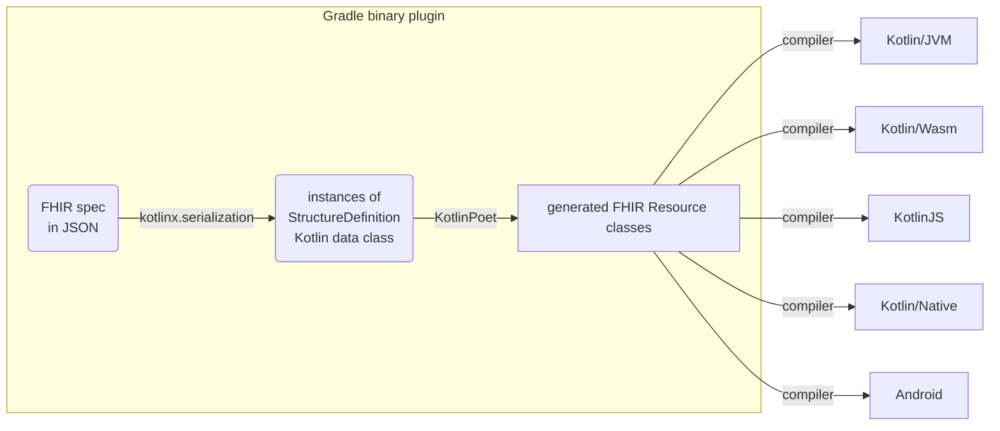

# Kotlin FHIR

[](https://central.sonatype.com/artifact/dev.ohs.fhir/fhir-model)
[](https://central.sonatype.com/artifact/dev.ohs.fhir/fhir-model-jvm)
[](https://central.sonatype.com/artifact/dev.ohs.fhir/fhir-model-wasm-js)
[](https://central.sonatype.com/artifact/dev.ohs.fhir/fhir-model-wasm-wasi)
[](https://central.sonatype.com/artifact/dev.ohs.fhir/fhir-model-js)
[](https://central.sonatype.com/artifact/dev.ohs.fhir/fhir-model-android)
[](https://central.sonatype.com/artifact/dev.ohs.fhir/fhir-model-iosx64)
[](https://central.sonatype.com/artifact/dev.ohs.fhir/fhir-model-iosarm64)
[](https://central.sonatype.com/artifact/dev.ohs.fhir/fhir-model-iossimulatorarm64)
[](https://opensource.org/licenses/Apache-2.0)

Kotlin FHIR is a lean and fast implementation of the
[HL7® FHIR®](https://www.hl7.org/fhir/overview.html) data model on
[Kotlin Multiplatform](https://kotlinlang.org/docs/multiplatform.html).

## Key features

* Lightweight & fast with a minimal footprint and zero bloat[^1]
* Clean, modern & elegant Kotlin code with minimalistic class definitions
* Code generation[^2] from FHIR specifications for completeness and maintainability
* JSON only[^3], no [XML](https://build.fhir.org/xml.html)
  or [Turtle](https://build.fhir.org/rdf.html) dependencies
* Multiplatform support for Android, iOS and web development, with JVM, native
  code and JavaScript targets
* Support for multiple FHIR versions

[^1]: No dependencies on logging, XML, or networking libraries or any platform-specific
dependencies. Only essential Kotlin Multiplatform dependencies are included, e.g.,
[`kotlinx.serialization`](https://github.com/Kotlin/kotlinx.serialization),
[`kotlix.datetime`](https://github.com/Kotlin/kotlinx-datetime), and
[Kotlin Multiplatform BigNum](https://github.com/ionspin/kotlin-multiplatform-bignum).

[^2]: Using [KotlinPoet](https://square.github.io/kotlinpoet/).

[^3]: It is also possible to serialize to other formats
[`kotlinx.serialization`](https://github.com/Kotlin/kotlinx.serialization) supports, such as
[protocol buffers](https://protobuf.dev/). However, there is no XML or Turtle support as of
Jan 2025.

## Supported platforms

The library supports the following
[target platforms](https://kotlinlang.org/docs/multiplatform-dsl-reference.html#targets):

| Target platform                    | Target          | Artifact suffix | Support |
|:-----------------------------------|:----------------|:----------------|:--------|
| Kotlin/JVM                         | `jvm`           | `-jvm`          | ✅       |
| Kotlin/Wasm                        | `wasmJs`        | `-wasm-js`      | ✅       |
| Kotlin/Wasm                        | `wasmWasi`      | `-wasm-wasi`    | ✅       |
| Kotlin/JS                          | `js`            | `-js`           | ✅       |
| Android applications and libraries | `androidTarget` | `-android`      | ✅       |

as well as a subset of
[tier 1 Kotlin/Native targets](https://kotlinlang.org/docs/native-target-support.html#tier-1), detailed below:

| Gradle target name | Artifact suffix      | Support |
|:-------------------|:---------------------|:--------|
| macosX64           | `-macosx64`          | ⛔       |
| macosArm64         | `-macosarm64`        | ⛔       |
| iosSimulatorArm64  | `-iossimulatorarm64` | ✅       |
| iosX64             | `-iosx64`            | ✅       |
| iosArm64           | `-iosarm64`          | ✅       |

The library does not support `macos` targets in the tier 1 list, or any
[tier2](https://kotlinlang.org/docs/native-target-support.html#tier-2) and
[tier3](https://kotlinlang.org/docs/native-target-support.html#tier-3) Kotlin/Native targets. This
reflects their limited usage currently rather than technical difficulty. Please contact the team if
you require support for these platforms.

## Data model

### Mapping FHIR primitive data types to Kotlin

In FHIR, primitive data types (e.g. in [R4](https://hl7.org/fhir/R4/datatypes.html)) are defined
using StructureDefinitions[^4]. For instance, the `date` type is defined in
`StructureDefinition-date.json`. While primitive, these types may include an `id` and `extension`s,
preventing direct mapping to Kotlin's primitive types. To resolve this issue, the library generates
a distinct Kotlin class for each FHIR primitive data type, for example, the `Date` class in`Date.kt`
file for the `date` type.

[^4]: A "JSON Definition" link to the StructureDefinition is now included for each FHIR primitive
data type in the [Data Types](https://build.fhir.org/datatypes.html) page in FHIR CI-BUILD.

However, the actual values within these FHIR primitive data types defined using FHIRPath types (e.g.
the `integer.value` element in `StructureDefinition-integer.json` has the FHIRPath type
`System.Integer`) still need to be mapped to Kotlin types in the generated code. The mapping is as
follows:

| FHIRPath type  | Kotlin type  |
|-----------------------------------------------------------------------------|-----------------------------------------------------------------------------|
| System.Boolean                                                              | kotlin.Boolean                                                              |
| System.String                                                               | kotlin.String                                                               |
| System.Integer                                                              | kotlin.Int                                                                  |
| System.Long                                                                 | kotlin.Long                                                                 |
| System.Decimal                                                              | com.ionspin.kotlin.bignum.decimal.BigDecimal                                |
| System.Date                                                                 | FhirDate                                                                    |
| System.Time                                                                 | kotlinx.datetime.LocalTime                                                  |
| System.DateTime                                                             | FhirDateTime                                                                |

> **Note:** [Kotlin Multiplatform BigNum](https://github.com/ionspin/kotlin-multiplatform-bignum)
> library's `BigDecimal` is used to preserve and respect the precision of decimal values as required
> by the specification. See the notes section in [Datatypes](https://hl7.org/fhir/datatypes.html).
>
> **Note:**  The `System.Date` and `System.DateTime` types are mapped to sealed interfaces
> `FhirDate` and `FhirDateTime` specifically generated to handle partial dates in FHIR. They are
> implemented using `LocalDate`, `LocalDateTime` and `UtcOffset` classes in the `kotlinx-datetime`
> library.

Since all FHIR data types are defined using FHIRPath types in their StructureDefinitions, mapping
FHIRPath types to Kotlin effectively covers all FHIR data types. For brevity, the full FHIR data
type mapping to Kotlin is omitted here. However, notable exceptions exist where the FHIR data type
uses a FHIRPath type that is either inconsistent with the base data type, or is unsuitable for
represent the data in Kotlin. These exceptions are listed below:

| FHIR data type  | FHIRPath type  | Kotlin type  |
|------------------------------------------------------------------------------|-----------------------------------------------------------------------------|-----------------------------------------------------------------------------|
| positiveInt                                                                  | System.String                                                               | Kotlin.Int                                                                  |
| unsignedInt                                                                  | System.String                                                               | Kotlin.Int                                                                  |

### Mapping FHIR data structure to Kotlin

Similarly, for more complex data structures in FHIR such as complex data types and FHIR resources,
the library maps each StructureDefinition JSON file to a dedicated Kotlin `.kt` file, each
containing a Kotlin data class representing the StructureDefinition. BackboneElements in FHIR are
represented as nested data classes since they are never reused outside the StructureDefinition. For
each occurrence of a choice type (e.g. in [R4](https://hl7.org/fhir/R4/formats.html#choice)), a
single sealed interface is generated with a subclass for each type.

| FHIR concept  |                  Kotlin concept                    |
|----------------------------------------------------------------------------|-------------------------------------------------------------------------------------------------------------------|
| StructureDefinition JSON file (e.g. `StructureDefinition-Patient.json`)    | Kotlin .kt file (e.g. `Patient.kt`)                                                                               |
| StructureDefinition (e.g. `Patient`)                                       | Kotlin data class (e.g. `data class Patient`)                                                                     |
| BackboneElement (e.g. `Patient.contact`)                                   | Nested Kotlin data class (e.g. `data class Contact` nested under `Patient`)                                       |
| Choice of data types (e.g. `Patient.deceased[x]`)                          | Sealed interface (e.g. `sealed interface Deceased` nested under `Patient` with subtypes `Boolean` and `DateTime`) |

The generated FHIR resource classes are Kotlin
[data classes](https://kotlinlang.org/docs/data-classes.html). They are compact and readable, with
automatically generated methods: `equals()`/`hashCode()`, `toString()`, `componentN()` functions,
and `copy()`.

The use of sealed interfaces for choice of data types, combined with
Kotlin's [smart casts](https://kotlinlang.org/docs/typecasts.html#smart-casts), eliminates
boilerplate type checks and makes code cleaner, more type-safe, and easier to write. This is
particularly true when used in `when` statements:

```kotlin
when (val multipleBirth = patient.multipleBirth) {
    is Patient.MultipleBirth.Boolean -> {
        // Smart cast to Boolean
        println("Whether patient is part of a multiple birth: ${multipleBirth.value.value}")
    }

    is Patient.MultipleBirth.Integer -> {
        // Smart cast to Integer
        println("Birth order: ${multipleBirth.value.value}")
    }

    null -> {
        // Do nothing
    }
}
```

The generated classes reflect the inheritance hierarchy defined by FHIR. For example, `Patient`
inherits from `DomainResource`, which inherits from `Resource`.

### Mapping FHIR ValueSets to Kotlin Enums

Kotlin enums classes are generated for value sets referenced by elements via [binding](https://hl7.org/fhir/R5/terminologies.html#binding).
The constants in the generated enum classes are derived from the `code` property of the expanded `CodeSystem` concepts in the [expansion packages](https://github.com/ohs-foundation/kotlin-fhir/tree/main/third_party/). The
value sets that are not bound to elements are excluded from code generation.

#### Shared vs. Local Enums

- If the `StructureDefinition` defines an element with a [**common binding**](https://build.fhir.org/ig/HL7/fhir-extensions/StructureDefinition-elementdefinition-isCommonBinding.html), a **shared enum** is generated and placed in the `dev.ohs.fhir.model.<r4|r4b|r5>.terminologies` package.  
  **Example:** `AdministrativeGender`
- If the element uses a **non-common binding**, a **local enum** is created inside the associated parent class.  
  **Example:** `NameUse` inside the `HumanName` class

#### Enum Naming and Content

The enum constants are derived from `ValueSet` definitions in the expansion packages for [R4](https://github.com/ohs-foundation/kotlin-fhir/tree/main/third_party/hl7.fhir.r4.expansions/package), [R4B](https://github.com/ohs-foundation/kotlin-fhir/tree/main/third_party/hl7.fhir.r4b.expansions/package), and [R5](https://github.com/ohs-foundation/kotlin-fhir/tree/main/third_party/hl7.fhir.r5.expansions/package).
Each `ValueSet` includes codes from one or more `CodeSystem` resources it references.

| FHIR concept  | Kotlin concept  |
|----------------------------------------------------------------------------|--------------------------------------------------------------------------------|
| ValueSet JSON file (e.g. `ValueSet-resource-types.json`)                   | Kotlin .kt file (e.g. `ResourceType`)                                          |
| ValueSet (e.g. `ResourceType`)                                             | Kotlin class (e.g. `enum class ResourceType`)                                  |

To comply with Kotlin’s enum naming convention—which requires names to start with a letter and avoid special characters—each code is transformed using a set of formatting rules.
This includes handling numeric codes,special characters, and FHIR URLs. After all transformations, the final name is converted to PascalCase to match Kotlin style guidelines.

| Rule # |                                          Description                                          |                                                           Example Input                                                           |     Example Output     |
|--------|-----------------------------------------------------------------------------------------------|-----------------------------------------------------------------------------------------------------------------------------------|------------------------|
| 1      | For codes that are full URLs, extract and return the last segment after the dot               | `http://hl7.org/fhirpath/System.DateTime` from [CodeSystem-fhirpath-types](http://hl7.org/fhir/R5/codesystem-fhirpath-types.html) | `DateTime`             |
| 2      | Specific special characters are replaced with readable keywords                               | `>=` from   [CodeSystem-quantity-comparator](http://hl7.org/fhir/R5/codesystem-quantity-comparator.html)                          | `GreaterThanOrEqualTo` |
|        |                                                                                               | `>`                                                                                                                               | `GreaterThan`          |
|        |                                                                                               | `<`                                                                                                                               | `LessThan`             |
|        |                                                                                               | `<=`                                                                                                                              | `LessThanOrEqualTo`    |
|        |                                                                                               | `!=` or `<>`                                                                                                                      | `NotEqualTo`           |
|        |                                                                                               | `=`                                                                                                                               | `EqualTo`              |
|        |                                                                                               | `*`                                                                                                                               | `Multiply`             |
|        |                                                                                               | `+`                                                                                                                               | `Plus`                 |
|        |                                                                                               | `-`                                                                                                                               | `Minus`                |
|        |                                                                                               | `/`                                                                                                                               | `Divide`               |
|        |                                                                                               | `%`                                                                                                                               | `Percent`              |
| 3.1    | Replace all non-alphanumeric characters including dashes (`-`) and dots (`.`) with underscore | `4.0.1` from [CodeSystem-FHIR-version](http://hl7.org/fhir/R5/codesystem-FHIR-version.html)                                       | `4_0_1`                |
| 3.2    | Prefix codes starting with a digit with an underscore                                         | `4.0.1` from [CodeSystem-FHIR-version](http://hl7.org/fhir/R5/codesystem-FHIR-version.html)                                       | `_4_0_1`               |
| 3.3    | Apply PascalCase to each segment between underscores while preserving the underscores         | `entered-in-error` from [CodeSystem-document-reference-status](http://hl7.org/fhir/R5/codesystem-document-reference-status.html)  | `Entered_In_Error`     |

#### Excluded ValueSets from Enum Generation

The following FHIR value sets are excluded from Kotlin enum generation.

|                                        ValueSet URL                                        |                                           Reason for Exclusion                                            | Affected Version(s) |
|--------------------------------------------------------------------------------------------|-----------------------------------------------------------------------------------------------------------|---------------------|
| [`http://hl7.org/fhir/ValueSet/mimetypes`](http://hl7.org/fhir/ValueSet/mimetypes)         | This value set cannot be expanded because of the way it is defined - it has an infinite number of members | `R4`, `R4B`, `R5`   |
| [`http://hl7.org/fhir/ValueSet/all-languages`](http://hl7.org/fhir/ValueSet/all-languages) | This value set cannot be expanded because of the way it is defined - it has an infinite number of members | `R4`, `R4B`, `R5`   |
| [`http://hl7.org/fhir/ValueSet/use-context`](http://hl7.org/fhir/ValueSet/use-context)     | This value set has >3800 codes when expanded; generated enum class code cannot compile.                   | `R4`, `R4B`, `R5`   |

### Search Parameters

The codegen reads `SearchParameter-*.json` files from the FHIR core packages and generates per-resource containers of typed search parameter `data object`s. This provides compile-time safe, discoverable access to FHIR search parameters.

A `SearchParam<R, T>` sealed interface is generated in the `search` subpackage of each version package (e.g. `dev.ohs.fhir.model.r4.search`). It carries the metadata for a search parameter and the typed `extract` function:

| Member       | Type                       | Description                                                                       |
|:-------------|:---------------------------|:----------------------------------------------------------------------------------|
| `paramName`  | `String`                   | The search parameter name as used in search URLs.                                 |
| `type`       | `SearchParamType`          | The search parameter type (number, date, string, token, …).                       |
| `expression` | `String`                   | The FHIRPath expression that extracts values for this param.                      |
| `target`     | `List<String>`             | Target resource types for reference search parameters.                            |
| `extract`    | `(resource: R) -> List<T>` | Pulls the values of type `T` out of a resource of type `R` for this search param. |

For each resource type that has search parameters, a `{Resource}SearchParam` container `object` is generated. Each search parameter is a nested `data object` that implements `SearchParam<{Resource}, T>` with the value type `T` derived from the FHIRPath expression. An `ALL` property exposes every search parameter for the resource. For example, `PatientSearchParam` looks like:

```kotlin
sealed interface SearchParam<in R : Resource, out T> {
  val paramName: String
  val type: SearchParamType
  val expression: String
  val target: List<String>
  fun extract(resource: R): List<T>
}

object PatientSearchParam {
  data object Birthdate : SearchParam<Patient, Date> {
    override val paramName = "birthdate"
    override val type = SearchParamType.fromCode("date")
    override val expression = "Patient.birthDate"
    override val target = emptyList<String>()
    override fun extract(resource: Patient) = listOfNotNull(resource.birthDate)
  }

  data object GeneralPractitioner : SearchParam<Patient, Reference> {
    override val paramName = "general-practitioner"
    override val type = SearchParamType.fromCode("reference")
    override val expression = "Patient.generalPractitioner"
    override val target = listOf("Practitioner", "Organization", "PractitionerRole")
    override fun extract(resource: Patient) = resource.generalPractitioner
  }
  // ... one data object per search parameter

  val ALL: List<SearchParam<Patient, *>> = listOf(Birthdate, GeneralPractitioner, /* ... */)
}

// Usage:
PatientSearchParam.Birthdate.extract(patient)              // type-safe: List<Date>
PatientSearchParam.ALL.forEach { it.extract(patient) }     // iterate all for indexing
```

#### Supported FHIRPath patterns

The codegen translates the following FHIRPath shapes into Kotlin extraction code:

| Pattern                           | Example expression                            | Generated extraction                                                                                                                                                                                                                                                                     |
|:----------------------------------|:----------------------------------------------|:-----------------------------------------------------------------------------------------------------------------------------------------------------------------------------------------------------------------------------------------------------------------------------------------|
| Simple property                   | `Patient.birthDate`                           | `listOfNotNull(resource.birthDate)`                                                                                                                                                                                                                                                      |
| Nested path                       | `Patient.address.city`                        | `resource.address.mapNotNull { it.city }`                                                                                                                                                                                                                                                |
| List property                     | `Patient.identifier`                          | `resource.identifier`                                                                                                                                                                                                                                                                    |
| Element cast `(X.path as Type)`   | `(Patient.deceased as dateTime)`              | `listOfNotNull((resource.deceased as? Patient.Deceased.DateTime)?.value)`                                                                                                                                                                                                                |
| Element cast `X.path.as(Type)`    | `Condition.onset.as(dateTime)`                | `listOfNotNull((resource.onset as? Condition.Onset.DateTime)?.value)`                                                                                                                                                                                                                    |
| Element (no cast)                 | `Patient.deceased`                            | `listOfNotNull(resource.deceased)` — without a cast, the caller gets the `Patient.Deceased` sealed interface itself rather than the underlying `Boolean` or `DateTime`                                                                                                                   |
| `where(resolve() is Type)` filter | `Account.subject.where(resolve() is Patient)` | `resource.subject.filter { it.reference?.value?.toString()?.contains("Patient/") == true }` — substring-matches `Reference.reference` against `Type/`, covering relative and absolute URL forms. Misses URN-form (`urn:uuid:…`), contained (`#id`), and `Reference.type`-only references |
| `where(field='value')` filter     | `Patient.telecom.where(system='email')`       | `resource.telecom.filter { it.system?.value?.toString() == "email" }`                                                                                                                                                                                                                    |

#### Unsupported FHIRPath patterns

When a FHIRPath expression doesn't match any of the shapes above, the codegen falls back to a stub: the search parameter's `extract()` returns `emptyList()` and its type parameter is `Any`. The metadata (`paramName`, `type`, `expression`, `target`) is still populated correctly. Downstream apps that need to support these search parameters can read the `expression` string and evaluate it with a FHIRPath engine.

There are 206 such unsupported search parameters across versions. They fall into the following categories. The "Full list" column links to a per-category section of [unsupported-search-params.md](docs/unsupported-search-params.md) containing every entry (param name, type, target, expression, source JSON file, canonical URL):

| Pattern                                                           | Count | Example                                                                                    | Why it isn't supported                                                                                                 | Full list                                                                                                       |
|:------------------------------------------------------------------|------:|:-------------------------------------------------------------------------------------------|:-----------------------------------------------------------------------------------------------------------------------|:----------------------------------------------------------------------------------------------------------------|
| `.ofType(Type)` choice narrowing                                  |   118 | `Observation.value.ofType(Quantity)`, `useContext.value.ofType(CodeableConcept)`           | Same intent as the supported `as`-cast form, but a different syntax that the resolver doesn't currently handle.        | [of-type](docs/unsupported-search-params.md#oftype-type-choice-narrowing)                                       |
| Empty FHIRPath (`expression = ""`)                                |    28 | `Patient.age`, `Resource._id`, `Resource._content`, `MedicationKnowledge.packaging-cost`   | The SearchParameter JSON has no extractable expression — there is nothing to translate.                                | [empty](docs/unsupported-search-params.md#empty-fhirpath-expression)                                            |
| `.extension('url')` access                                        |    20 | `Patient.extension('http://hl7.org/fhir/StructureDefinition/patient-mothersMaidenName')`   | Fetching a specific extension by URL isn't implemented. Some R5 expressions add a trailing `.value`.                   | [extension](docs/unsupported-search-params.md#extension-url-access)                                             |
| `composite` type with no component path                           |    13 | `Observation.code-value-concept`, `Device.code-value-concept`                              | Composite expressions are typically just the resource name; resolving them requires combining component params.        | [composite](docs/unsupported-search-params.md#composite-search-parameters-with-no-component-path)               |
| Boolean logic (`and`, `or`)                                       |     5 | `Patient.deceased.exists() and Patient.deceased != false`                                  | Boolean combinators aren't translated. Only the `Patient/Person/Practitioner.deceased` token params use this.          | [boolean-logic](docs/unsupported-search-params.md#boolean-logic-and-or)                                         |
| Multi-resource union without resource prefix                      |     3 | `name \| alias` for `InsurancePlan.name`                                                   | When no branch of the union starts with the resource name, the expression-slicing step finds nothing to resolve.       | [union](docs/unsupported-search-params.md#multi-resource-union-without-a-resource-prefix)                       |
| `where(...)` predicate other than `field='value'` / `resolve()`   |     3 | `QuestionnaireResponse.item.where(extension('…').exists()).answer.value.ofType(Reference)` | The matcher only handles `where(field='value')` and `where(resolve() is Type)`. Function-call predicates fall through. | [where-predicate](docs/unsupported-search-params.md#where-predicates-other-than-fieldvalue-and-resolve-is-type) |
| Other (parens, indexed access, bare path without resource prefix) |    16 | `(Citation.classification.type)`, `Bundle.entry[0].resource`, `id` for `Resource._id`      | Mixed: leading parens, `[0]` indexing, and bare paths missing the resource prefix all bypass the resolver.             | [other](docs/unsupported-search-params.md#other-patterns-parens-indexed-access-bare-paths)                      |

## Serialization and deserialization

The [Kotlin serialization](https://github.com/Kotlin/kotlinx.serialization) library is used for JSON
serialization/deserialization. All generated FHIR resource classes are marked with annotation
`@Serializable`.

A particular challenge in the serialization/deserialization process is that FHIR primitive data
types are represented by two JSON properties (e.g.
in [R4](https://hl7.org/fhir/R4/json.html#primitive)). As a result, the Kotlin data class of any
FHIR resource or element containing primitive data types cannot be directly mapped to JSON.

To address this issue, the library generates
[surrogate](https://github.com/Kotlin/kotlinx.serialization/blob/master/docs/serializers.md#composite-serializer-via-surrogate)
classes (e.g. `PatientSurrogate`) to map each primitive data type to two JSON properties (e.g.
`gender` and `_gender`) . It also generates custom serializers (e.g. `PatientSerializer`) that
delegate the serialization/deserialization process to the corresponding surrogate classes and
translate between the data classes and surrogate classes (via the `toModel` and `fromModel`
functions). This process is repeated for backbone elements.

Serialization and deserialization for choice types (e.g. `Patient.multipleBirth`) follow a similar
surrogate-based approach. For example, for `Patient.multipleBirth`, the library generates a custom
serializer `PatientMultipleBirthSerializer` that delegates serialization / deserialization to
`PatientMultipleBirthSurrogate`.

This process has an additional step to flatten and unflatten the JSON properties for the choice type
elements using the FhirJsonTransformer (in
[R4](https://github.com/ohs-foundation/kotlin-fhir/blob/main/fhir-model/src/commonMain/kotlin/dev/ohs/fhir/model/r4/FhirJsonTransformer.kt),
[R4B](https://github.com/ohs-foundation/kotlin-fhir/blob/main/fhir-model/src/commonMain/kotlin/dev/ohs/fhir/model/r4b/FhirJsonTransformer.kt),
[R5](https://github.com/ohs-foundation/kotlin-fhir/blob/main/fhir-model/src/commonMain/kotlin/dev/ohs/fhir/model/r5/FhirJsonTransformer.kt)),
so the choice type can be handled independently by a surrogate. This also avoids hitting the
[JVM constructor argument limit](https://docs.oracle.com/javase/specs/jvms/se19/html/jvms-4.html#jvms-4.3.3)
caused by FHIR fields with many possible types (e.g.,
[ElementDefinition.pattern](https://www.hl7.org/fhir/R4B/elementdefinition-definitions.html#ElementDefinition.pattern_x_)).
Instead of expanding all types in the model's surrogate class — which would exceed the limit —
choice type fields are handled by their own serializers and surrogate classes.

The following diagram illustrates the deserialization of a Patient JSON. The serialization process
is simply the reverse.

```mermaid
graph LR
    A["**Patient JSON**
    {
    #nbsp;#nbsp;gender: ...
    #nbsp;#nbsp;_gender: ...
    #nbsp;#nbsp;multipleBirthBoolean: ...
    #nbsp;#nbsp;_multipleBirthBoolean: ...
    #nbsp;#nbsp;multipleBirthInteger: ...
    #nbsp;#nbsp;_multipleBirthInteger: ...
    #nbsp;#nbsp;contact: [
    #nbsp;#nbsp;#nbsp;#nbsp;{
    #nbsp;#nbsp;#nbsp;#nbsp;#nbsp;#nbsp;name: {
    #nbsp;#nbsp;#nbsp;#nbsp;#nbsp;#nbsp;#nbsp;#nbsp;family: ...
    #nbsp;#nbsp;#nbsp;#nbsp;#nbsp;#nbsp;#nbsp;#nbsp;_family: ...
    #nbsp;#nbsp;#nbsp;#nbsp;#nbsp;#nbsp;#nbsp;#nbsp;given: ...
    #nbsp;#nbsp;#nbsp;#nbsp;#nbsp;#nbsp;}
    #nbsp;#nbsp;#nbsp;#nbsp;#nbsp;#nbsp;telecom: [...]
    #nbsp;#nbsp;#nbsp;#nbsp;}
    #nbsp;#nbsp;]
    }
    "]
    B["**Patient JSON (transformed)**
    {
    #nbsp;#nbsp;gender: ...
    #nbsp;#nbsp;_gender: ...
    #nbsp;#nbsp;multipleBirth:{
    #nbsp;#nbsp;#nbsp;#nbsp;multipleBirthBoolean: ...
    #nbsp;#nbsp;#nbsp;#nbsp;_multipleBirthBoolean: ...
    #nbsp;#nbsp;#nbsp;#nbsp;multipleBirthInteger: ...
    #nbsp;#nbsp;#nbsp;#nbsp;_multipleBirthInteger: ...
    #nbsp;#nbsp;}
     #nbsp;#nbsp;contact: [
    #nbsp;#nbsp;#nbsp;#nbsp;{
    #nbsp;#nbsp;#nbsp;#nbsp;#nbsp;#nbsp;name: {
    #nbsp;#nbsp;#nbsp;#nbsp;#nbsp;#nbsp;#nbsp;#nbsp;family: ...
    #nbsp;#nbsp;#nbsp;#nbsp;#nbsp;#nbsp;#nbsp;#nbsp;_family: ...
    #nbsp;#nbsp;#nbsp;#nbsp;#nbsp;#nbsp;#nbsp;#nbsp;given: ...
    #nbsp;#nbsp;#nbsp;#nbsp;#nbsp;#nbsp;}
    #nbsp;#nbsp;#nbsp;#nbsp;#nbsp;#nbsp;telecom: [...]
    #nbsp;#nbsp;#nbsp;#nbsp;}
    #nbsp;#nbsp;]
    }
    "]
    C["**PatientSurrogate object**
    gender
    _gender
    multipleBirth (Sealed Interface)
    contact (MutableList&lt;Patient.Contact&gt;)
    "]
    D["**PatientMultipleBirthSurrogate object**
    multipleBirthBoolean: ...
    _multipleBirthBoolean: ...
    multipleBirthInteger: ...
    _multipleBirthInteger: ...
    "]
    E["**Patient object**
    gender
    multipleBirth
    contact
    "]
    F["**PatientMultipleBirth** sealed interface
    "]
    G["**PatientContactSurrogate object**
    name: HumanName
    telecom: MutableList&lt;ContactPoint&gt;
    "]
    H["**Patient.Contact** backbone element
    "]

    A-->Transformer[FhirJsonTransformer]@{ shape: pill }
    subgraph S1[PatientSerializer]
      Transformer --> B
      B -- deserialize fields --> C
      B -- deserialize sealed interfaces (via surrogate) --> D
      subgraph S2[PatientMultipleBirthSerializer]
        D -- convert to model --> F
      end
      F --> C
      B -- deserialize backbone elements (via surrogate) --> G
      subgraph S3[PatientContactSerializer]
        G -- convert to model --> H
      end
      H --> C
    end
    C -- convert to model --> E

    style A text-align:left
    style B text-align:left
    style C text-align:left
    style D text-align:left
    style E text-align:left
    style F text-align:left
    style G text-align:left
    style H text-align:left
    style S1 stroke-dasharray: 5 5
    style S2 stroke-dasharray: 5 5
    style S3 stroke-dasharray: 5 5
```



*Figure 1: Deserialization of a Patient JSON*

## Implementation

### Overview

The Kotlin FHIR library uses a Gradle binary plugin to automate the generation of Kotlin code
directly
from FHIR specification. This plugin uses [
`kotlinx.serialization`](https://github.com/Kotlin/kotlinx.serialization) library to parse and load
FHIR resource `StructureDefinition`s into an in-memory representation, and then
uses [KotlinPoet](https://square.github.io/kotlinpoet/) to generate corresponding class definitions
for each FHIR resource type. Finally, these generated Kotlin classes are compiled into JVM,
Wasm, JS, Native, and Android targets, enabling their use across various platforms.



*Figure 2: Architecture diagram*

### Definitions

Kotlin code is generated for StructureDefinitions in the following FHIR packages:

- [hl7.fhir.r4.core](https://simplifier.net/packages/hl7.fhir.r4.core)
- [hl7.fhir.r4b.core](https://simplifier.net/packages/hl7.fhir.r4b.core)
- [hl7.fhir.r5.core](https://simplifier.net/packages/hl7.fhir.r5.core)

> **Note:** The following are **NOT** included in the generated code:
> - [Logical](https://hl7.org/fhir/R4/valueset-structure-definition-kind.html) StructureDefinitions,
> such as [Definition](https://hl7.org/fhir/R4/definition.html),
> [Request](https://hl7.org/fhir/R4/request.html), and [Event](https://hl7.org/fhir/R4/event.html)
> in R4
> - Profiles StructureDefinitions
> - Constraints (e.g. in [R4](https://hl7.org/fhir/R4/conformance-rules.html#constraints)) and
> bindings (e.g. in [R4](https://hl7.org/fhir/R4/terminologies.html#binding)) in
> StructureDefinitions are not represented in the generated code
> - CapabilityStatements, CodeSystems, ConceptMaps, NamingSystems, OperationDefinitions,
> and ValueSets

### FHIR codegen

To put all this together, the
[FHIR codegen](fhir-codegen/gradle-plugin/src/main/kotlin/dev/ohs/fhir/codegen) in the Gradle
binary plugin generates, for each FHIR resource type:

- the model class (the primary class) in the root package e.g. `dev.ohs.fhir.model.r4`,
- the surrogate classes (one for basic primitive type
  mapping to JSON properties, plus extras for each multi-choice/polymorphic property and backbone element)
  in the surrogate package e.g. `dev.ohs.fhir.model.r4.surrogates`, and
- the serializer classes (to delegate serialization/deserialization to the corresponding surrogate classes) in the
  serializer package e.g. `dev.ohs.fhir.model.r4.serializers`,

using
[`ModelTypeSpecGenerator`](fhir-codegen/gradle-plugin/src/main/kotlin/dev/ohs/fhir/codegen/ModelTypeSpecGenerator.kt),
[`SurrogateTypeSpecGenerator`](fhir-codegen/gradle-plugin/src/main/kotlin/dev/ohs/fhir/codegen/SurrogateTypeSpecGenerator.kt),
and
[`SerializerTypeSpecGenerator`](fhir-codegen/gradle-plugin/src/main/kotlin/dev/ohs/fhir/codegen/SerializerTypeSpecGenerator.kt),
respectively.

Additionally,
the [`schema`](fhir-codegen/gradle-plugin/src/main/kotlin/dev/ohs/fhir/codegen/schema) package in
the FHIR codegen contains the schema for structure definitions and helper functions for processing
them, and the
[`primitives`](fhir-codegen/gradle-plugin/src/main/kotlin/dev/ohs/fhir/codegen/primitives)
package contains code to generate special data classes and serializers for primitive data types as
mentioned [earlier](#mapping-fhir-primitive-data-types-to-kotlin).

## User Guide

### Adding the library dependency to your project

To use the Kotlin FHIR model in your project, you need to add the Kotlin FHIR library dependency to
your project. To do that, first make sure to include the `mavenCentral()`[^5] repository in the
`build.gradle.kts` file in your project root.

[^5]: Early versions of this library (up to `1.0.0-beta02`) were published under the group ID
`com.google.fhir` on [Google Maven](https://maven.google.com/web/index.html?q=fhir-model).

```
// build.gradle.kts
repositories {
    // Other repositories such as gradlePluginPortal() and google()
    mavenCentral()
}
```

Next, follow the instructions for your specific project type.

#### Kotlin Multiplatform Projects

For Kotlin Multiplatform projects, add the dependency to the shared `commonMain` source set within
the `kotlin` block of the module's `build.gradle.kts` file (e.g., `composeApp/build.gradle.kts` or
`shared/build.gradle.kts`). This makes the library available across all platforms in your project.

```
// e.g., composeApp/build.gradle.kts or shared/build.gradle.kts
kotlin {
    sourceSets {
        commonMain.dependencies {
            implementation("dev.ohs.fhir:fhir-model:1.0.0-beta03")
        }
    }
}
```

#### Android projects

For Android projects, add the dependency to the `dependency` block in the module's
`build.gradle.kts` file (e.g., `app/build.gradle.kts`).

```
// e.g., app/build.gradle.kts
dependencies {
    implementation("dev.ohs.fhir:fhir-model:1.0.0-beta03")
}
```

### Working with FHIR resources

The generated Kotlin classes for FHIR resources are organized in version-specific packages:
`dev.ohs.fhir.model.<FHIR_VERSION>` where `<FHIR_VERSION>`∈ {`r4`, `r4b`, `r5`}.

For example:

- `dev.ohs.fhir.model.r4`
- `dev.ohs.fhir.model.r4b`
- `dev.ohs.fhir.model.r5`

Within each package, you'll find the corresponding Kotlin classes for all FHIR resources of that
version. For example, the `Patient` class generated for FHIR R4 can be found in the
`dev.ohs.fhir.model.r4` package.

To create a new instance of a FHIR resource, use the provided builder class. For example:

```kotlin
import dev.ohs.fhir.model.r4.Date
import dev.ohs.fhir.model.r4.FhirDate
import dev.ohs.fhir.model.r4.HumanName
import dev.ohs.fhir.model.r4.Patient

fun main() {
    val patient =
        Patient.Builder()
            .apply {
                id = "patient-01"
                name.add(
                    HumanName.Builder().apply {
                        given.add(dev.ohs.fhir.model.r4.String.Builder().apply { value = "John" })
                    }
                )
                birthDate = Date.Builder().apply { value = FhirDate.fromString("2000-01-01") }
            }
            .build()
}
```

### Serialization and deserialization

To serialize and deserialize FHIR resources, use the provided `Fhir<FHIR_VERSION>Json` class in the
corresponding version-specific package:

```kotlin
import dev.ohs.fhir.model.r4.FhirR4Json  // or dev.ohs.fhir.model.r4b.FhirR4bJson or dev.ohs.fhir.model.r5.FhirR5Json

fun main() {
    val jsonR4 = FhirR4Json()
    val jsonR4 = FhirR4Json({ ignoreUnknownKeys = true })  // optional lambda to configure the Json object
}
```

This class configures [kotlinx.serialization](https://github.com/Kotlin/kotlinx.serialization)'s
`Json` object to handle serialization and deserialization for FHIR resources. It takes an optional
initializer function for the user to customize the `Json` object even further. For more details, see
[Kotlin Serialization Guide](https://github.com/Kotlin/kotlinx.serialization/blob/master/docs/json.md#json-configuration).

Once this is correctly configured, use `encodeToString` and `decodeFromString` functions to
serialize and deserialize:

```kotlin
import dev.ohs.fhir.model.r4.Patient
import dev.ohs.fhir.model.r4.Resource

fun main() {
    val jsonString = jsonR4.encodeToString(patient)  // Serialization
    val reconstructedPatient = jsonR4.decodeFromString(jsonString)  // Deserialization
    
    check(reconstructedPatient is Patient)
}
```

## Developer Guide

This section is for developers who want to contribute to the library.

### Running the codegen locally

You can run the codegen locally to generated FHIR models for all supported FHIR versions at once[^6]:

[^6]: To generate FHIR models for specific versions, run `./gradlew <FHIR_VERSION>` where
`<FHIR_VERSION>`∈ {`r4`, `r4b`, `r5`}. The generated code will be located in the
`fhir-model/build/generated/<FHIR_VERSION>` subdirectory.

```bash
./gradlew codegen
```

This will sync all generated code into the `fhir-model/src/commonMain/kotlin` directory and apply
consistent formatting using the [`spotless`](https://github.com/diffplug/spotless) plugin.

> **Note:** The library is designed for use as a dependency. Directly copying generated code into
> your project is generally discouraged as it can lead to maintenance issues and conflicts with
> future updates.

### Testing

The library includes comprehensive tests suites for the example resources published in the following
packages:

- [hl7.fhir.r4.examples](https://simplifier.net/packages/hl7.fhir.r4.examples) (5309 examples)
- [hl7.fhir.r4b.examples](https://simplifier.net/packages/hl7.fhir.r4b.examples) (2840 examples)
- [hl7.fhir.r5.examples](https://simplifier.net/packages/hl7.fhir.r5.examples) (2822 examples)

For each JSON example of a FHIR resource in the referenced packages, three categories of tests are
executed:

1. Equality test:
   - First instance: Deserialize the JSON into a FHIR resource object.
   - Second instance: Deserialize the same JSON into another FHIR resource object.
   - Verification: The two objects are structurally equal (using `==` operator).
2. Serialization round-trip test:
   - Deserialization: Deserialize the JSON into a FHIR resource object.
   - Serialization: Serialize the object back into JSON.
   - Verification: The regenerated JSON is compared character by character[^7] with the original
     JSON.
3. Builder round-trip test:
   - Deserialization: Deserialize the JSON into a resource object.
   - Conversion to builder: Convert the object into a builder using `toBuilder()` function.
   - Conversion to resource: Build a new FHIR resource object using `build()` function
   - Verification: The reconstructed object from the builder is equal to the original object.
4. Search parameter test:
   - Loads the source `SearchParameter-*.json` files as ground truth.
   - For each concrete resource across R4, R4B, and R5, uses JVM reflection on the
     generated `{Resource}SearchParam` sealed class and its `ALL` companion property
     to verify:
     - Count: `ALL` contains exactly one entry per search parameter defined for the resource.
     - Name: each entry's `paramName` matches the `code` from the JSON definition.
     - Type: each entry's `type` matches the FHIR search parameter type (e.g., `"date"`).
     - Expression: the entry's `expression` matches the resource-specific portion of the
       FHIRPath expression from the JSON definition.
     - Target: the entry's `target` list matches the `target` resource types from the
       JSON definition.

[^7]: There are several exceptions. The FHIR specification allows for some variability in data
representation, which may lead to differences between the original and newly serialized JSON. For
example, additional trailing zeros in decimals and times, non-standard JSON property ordering, the
use of `+00:00` instead of `Z` for zero UTC offset, and large numbers represented in standard
notation instead of scientific notation (e.g. 1000000000000000000 instead of 1E18). The
serialization process normalizes these variations, resulting in potentially different JSON output.
However, in all of these cases, semantic equivalence is maintained.

These tests are set up to run on JVM and as Android unit tests. To run them locally:

```shell
./gradlew :fhir-model:jvmTest
./gradlew :fhir-model:testDebugUnitTest
```

### Publishing

For a comprehensive understanding of publishing KMP libraries to Maven Central, see the
[Kotlin Multiplatform Publishing Guide](https://kotlinlang.org/docs/multiplatform-publish-lib.html)
and the
[Maven Central Publishing Guide](https://central.sonatype.org/publish/publish-portal-guide/).

> **Note:** The project has already been set up to be released to Maven using the
> [`gradle-maven-publish-plugin`](https://github.com/vanniktech/gradle-maven-publish-plugin). The
> following sections outline the additional setup required for a developer to publish to Maven Local
> and Maven Central.

#### Maven Local

To publish artifacts to your local Maven repository (`~/.m2/repository`) for local development and
testing, run:

```bash
./gradlew :fhir-model:publishToMavenLocal
```

#### Maven Central

To publish a new release to Maven Central, first set up your GPG signing key and repository
credentials to Gradle following the aforementioned official guides.

**Best Practice**: Store these sensitive details in your **Global Gradle Properties** file at
`~/.gradle/gradle.properties` (User Home directory). This ensures they are available to all your
projects but are never accidentally committed to the Git repository.

Your `~/.gradle/gradle.properties` should contain:

```properties
# Maven Central Credentials
mavenCentralUsername=YOUR_USERNAME
mavenCentralPassword=YOUR_PASSWORD

# GPG Key Details
signing.keyId=YOUR_KEY_ID
signing.password=YOUR_KEY_PASSWORD
signing.secretKeyRingFile=/path/to/secring.gpg
```

You can verify your signing setup by running:

```bash
./gradlew :fhir-model:checkSigningConfiguration
```

To publish to Maven Central, run:

```bash
./gradlew :fhir-model:publishToMavenCentral
```

## Acknowledgements

Thanks to [Yigit Boyar](https://github.com/yigit) for helping bootstrap this project and generously
sharing his expertise in Kotlin Multiplatform and Gradle.
